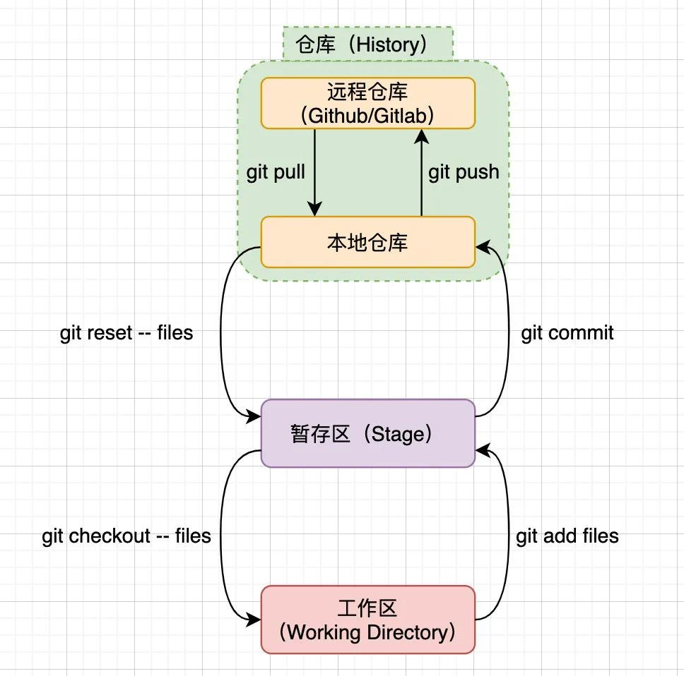

### Git使用学习经历
- 1. [菜鸟教程](https://www.runoob.com/git/git-tutorial.html)
- 2. [codesheep推送](https://mp.weixin.qq.com/s/DQVVYOWdOPuRsy3m0fg6Xg)

#### 0.Git安装配置
Git在widows上直接下载exe文件进行安装，安装后需要配置**用户名**和**用户邮箱**。Git提供了git config命令用于配置git
- Git提供几个配置文件 
    - /etc/gitconfig:系统中对所有用户都普遍适用的配置,git config --system读写的就是该文件
    - ~/gitconfig:用户目录下的配置文件只适用于该用户，git config --global读写的是该文件
    - .git/config:仅对当前项目有效

- 列出所有的配置信息
    git config --list

#### 1.git工作流程及原理
- clone远程仓库为工作目录
- 在工作目录中修改代码，同时更新他人的修改
- 修改完毕后，可以查看different,推送到远程仓库

#### 2. git的基本操作
##### 2.1 Git工作流程图

workspace：工作区
staging area:暂存区
local repository:本地仓库
remote repository:远程仓库

##### 2.2 基本操作
###### 2.2.1 创建
- git init 
使用一个已存在的目录作为git仓库，会在文件夹下生成.git文件夹
`git init` 将当前文件夹作为git仓库
`git init files` 将files文件夹作为git仓库
- git clone
从现有仓库中clone
`git clone Url`:colne Url指定的远程仓库到当前文件夹
`git clone Url localfiles`: colone Url指定的远程仓库到本地指定的文件夹
###### 2.2.2 添加到暂存区
- git add
将文件加入到版本控制当中，对这些文件进行跟踪，将文件置于暂存区
`git add *.c`
`git add hello.md`
`git add .`

###### 2.2.3 添加到本地仓库
- git commit
`git commit file -m "message"`:提交暂存区的文件到仓库
`git commit [file1] [file2] - m "message"`:提交缓存区的指定文件到仓库
- git commit -a
忽略提交到暂存区的步骤，直接提交到仓库
- git commit --amend
本次提交覆盖上一次提交，当上一次提交之后发现有东西忘记修改了，考虑到重新commit的话会因为对一个问题的多次提交而产生混乱，此时可以覆盖上一次commit.
###### 2.2.4 查看status
- git status
查看自上次提交之后是否对文件再次修改
- git status -s
以紧凑格式查看文件状态
??: 新添加的未跟踪文件
A: 新添加到暂存区中的文件
M: 左边的 M 表示该文件被修改了并放入了暂存区
M: 右边的 M 表示该文件被修改了但是还没放入暂存区
D: 被删除的文件
###### 2.2.5 比较

- git diff
`git diff file`:显示暂存区与工作区中file文件的差异
`git diff --cached file` or `git diff --staged file`:显示暂存区与上一次commit的差异
`git diff [first-commit]...[second-commit]`:显示两次提交的差异
`git diff dev`：将工作区与指定分支dev进行比较
`git diff HEAD`:将HEAD指针指向的commit与工作区进行比较
###### 2.2.6 回退
- git reset

###### 2.2.7 删除文件
- git rm
`git rm file`:从暂存区和工作区删除文件
`git rm -f filr`:强制从暂存区和工作区删除(之前修改过的文件放在了暂存区)
`git rm --cached file`：将文件从暂存区删除，保留工作区
`git rm -r Diectory`：递归删除文件夹
###### 2.2.8 移动及重命名
- git mv

###### 2.2.9 查看历史提交记录
- git log
- git log --oneline
查看历史记录的简洁版本，每一行一条记录
- git log graph
查看创建分支、合并的信息
- git log --reverse
以时间逆序的顺序显示所有的历史操作
- git log --author=''
查看指定用户的提交历史记录
- git blame file
查看指定文件的历史提交记录
##### 2.2.10 回滚

- git checkout -- files
将files从暂存区复制到工作区，覆盖工作区的更改
- git reset -- files
撤销最近的一次commit
- git reset commitID --sort
只改变commit信息，不改变暂存区和工作区
- git reset commitID 
回滚暂存区，不影响工作区
- git reset commitID --hard
回滚暂存区和工作区
##### 2.3 远程操作
###### 2.3.1 git remote
- git remote -v
显示所有的远程仓库
- git remote show remote_alias
显示远程仓库remote_alias的信息
- git remote add alias IP
根据IP添加远程仓库，别名为alias
- git remote rm remote_alias
删除远程仓库
- git remote rename old_name new_name
修改远程仓库的名称

###### 2.3.2 git fetch | git merge
- git fetch alias
提取远程服务器alias的更新
- git merge alias/branch
将服务器上的更新合并到当前branch
###### 2.3.3 git pull
将远程仓库的代码合并到本地分支
- git pull alias remote_branch:local branch
将远程服务器alias的brach分支合并到本地仓库的local brach分支
若是合并到当前分支，可以省略本地分支参数

###### 2.3.4 git push
将本地仓库内容提交到远程仓库
- git push alias local_branch:remote_branch
将本地local_branch分支的内容合并到远程分支remote_branch.
**注意与git pull格式的区别，本地分支与远程分支的顺序**
- git push --force local_branch
当本地分支与远程分支有差异时强制更新
- git push alias --delete branch_name
删除远程仓库的分支
##### 2.4 分支管理
- git branch
查看所有分支
- git branch brachname
创建分支，分支名为brachname；例如在matster中创建分支dev,dev保存的是最近一次提交的内容，修改master的内容并提交并不会影响dev分支
- git checkout branchname | git checkout -b branchname

切换到名为brachname的分支，切换分支时git会根据最新的分支快照更新当前文件夹内容.
-b 参数创建分支并切换到新建的分支
- git branch -d branchname
删除指定的分支
- git merch
分支合并

#### git标签
标记某个特定版本
- git tag -a tag_name
为**最新一次提交**创建tag_name标签，会弹出默认的Editor撰写tag标签注解。
或git tag -a tag_name -m message直接指明注解
- git tag -a tag_name version
为某个版本version追加标签
